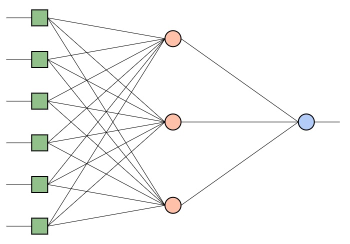

# Neural Network

This is the ANN (Artificial neural network) builder and trainer.

## Why ANN?
* THe features impact are calculated by the computer
* Great prediction
* Quick results
* Running using trained network is pretty quick

## Steps
1. Cleanup the unnecessary columns - Remove all the uniq keys, this will not improve the network
1. Normalize the data - The network expects to get values between 0-1, we need to normalize the values to fit this requirements
1. Train the network - Make the GPU sweat! - Learn and improve the connections weights
1. Export the network - Write the network weight values to a file
1. Run the trained network - Use the trained network to predict the earnings of a building

## How to run

```bash
npm i
npm start
```


## Visitation
